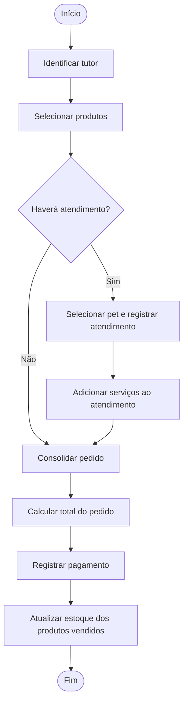
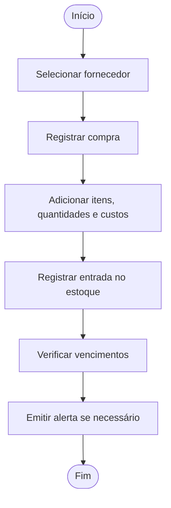

# Pet Shop

# Projeto Integrador — ERP para Pet Shop

> Modelagem conceitual dos processos de um pet shop.

> Grupo 5 - Integrantes:

```
  Breno Freire — 47787031
  Emylly Nickolly Viana de Oliveira — 47642785
  Gustavo Lima — 47958561
  Murilo Neves — 47443855
  Nickyson Poliacov — 47765798
  Pedro Henrique Amaral — 47580488
  Renan Rodrigues — 47497521
  Richard Fernandes — 47934077
  Thales Alexandre — 47645474
  Adrian Cristian — 47567210
```

## 1. Identificação da equipe

- Curso: Engenharia de Software
- Disciplina: Modelagem de Dados

- Professor(a): Clóvis

## 2. Caracterização da empresa

- Nome da empresa: 
- Segmento: Pet Shop
- Produtos
- Serviços:
- Clientes: tutores responsáveis por um ou mais pets
- Funcionários/setores:
- Funcionamento atual:

A demanda registrada pelo grupo é organizar os dados do pet shop e possibilitar avisos sobre produtos próximos do vencimento. Os detalhes sobre o funcionamento atual da empresa precisam ser confirmados com base no levantamento realizado pelo grupo.

## 3. Justificativa da escolha

O pet shop foi escolhido por envolver processos relacionados entre si: cadastro de tutores e pets, atendimento, venda de produtos, compra de mercadorias, estoque e controle de despesas. A modelagem permite analisar como esses dados se conectam e reduzir registros desconectados.

## 4. Problemas e necessidades identificados

- Organizar os dados de tutores, pets, produtos e serviços.
- Acompanhar os atendimentos realizados para cada pet.
- Registrar produtos vendidos e serviços prestados na mesma conta.
- Controlar compras e movimentações de estoque.
- Identificar produtos próximos do vencimento.

> Confirmar com a empresa quais desses pontos já causam problemas e como são controlados atualmente.

## 5. Processos de negócio

1. Cadastrar tutor e associar seus pets.
2. Registrar o atendimento de um pet e os serviços realizados.
3. Montar um pedido com produtos e, quando houver, atendimentos.
4. Registrar o pagamento do pedido.
5. Registrar compras de fornecedores e atualizar o estoque.
6. Registrar despesas operacionais e acompanhar seus pagamentos.
7. Consultar produtos próximos do vencimento.

## 6. Requisitos funcionais

- RF01 — O sistema deverá cadastrar tutores e pets.
- RF02 — O sistema deverá associar pets a um ou mais tutores.
- RF03 — O sistema deverá registrar atendimentos, pets atendidos, funcionários responsáveis e serviços prestados.
- RF04 — O sistema deverá registrar pedidos com itens de produto e atendimentos.
- RF05 — O sistema deverá registrar o pagamento associado ao pedido.
- RF06 — O sistema deverá cadastrar produtos, fornecedores, compras e itens de compra.
- RF07 — O sistema deverá registrar entradas e saídas de estoque.
- RF08 — O sistema deverá avisar sobre produtos próximos do vencimento.
- RF09 — O sistema deverá registrar despesas e suas categorias.

## 7. Requisitos não funcionais

Os requisitos abaixo são propostas para o grupo validar:

- RNF01 — O sistema deverá restringir o acesso aos dados pessoais de tutores.
- RNF02 — O sistema deverá manter consistência entre pedidos, pagamentos e estoque.
- RNF03 — O sistema deverá permitir consultar os registros de forma clara.
- RNF04 — O sistema deverá manter histórico suficiente para consultar compras e atendimentos anteriores.

## 8. Regras de negócio

- RN01 — Um tutor pode estar associado a vários pets, e um pet pode estar associado a vários tutores.
- RN02 — A relação entre tutor e pet será representada por `TUTELA`, identificada no modelo lógico pela chave composta `id_tutor` + `id_pet`.
- RN03 — Cada atendimento pertence a um único pet. Um pet pode possuir vários atendimentos. O grupo registrou PET `(1,N)` e ATENDIMENTO `(1,1)`; confirmar se um pet pode ser cadastrado antes do primeiro atendimento. Se puder, a cardinalidade mínima de PET deve ser zero.
- RN04 — Cada atendimento tem um funcionário responsável; um funcionário pode realizar vários atendimentos.
- RN05 — Um atendimento pode incluir um ou mais serviços, e um serviço pode aparecer em vários atendimentos.
- RN06 — Cada pedido pertence a um tutor.
- RN07 — Um pedido pode conter itens de produto e atendimentos, permitindo cobrar produtos e serviços juntos.
- RN08 — Um item de pedido representa um único produto e registra quantidade e preço unitário praticado naquela venda.
- RN09 — O pedido terá um único pagamento associado, que quita o total dos produtos e serviços. Se o negócio permitir pagamentos parciais, esta regra e a cardinalidade deverão ser alteradas.
- RN10 — Cada compra é realizada com um fornecedor e contém um ou mais itens de compra.
- RN11 — Cada item de compra corresponde a um produto e registra quantidade e preço unitário de aquisição.
- RN12 — Entradas e saídas de produtos devem gerar movimentações de estoque.
- RN13 — Cada despesa operacional deve ser classificada em uma categoria e registrada por um funcionário.
- RN14 — Uma compra de produto para revenda atualiza o estoque. Ela não deve ser duplicada como despesa operacional; se o sistema precisar controlar valores a pagar ao fornecedor, isso deverá ser modelado separadamente.
- RN15 — O prazo que define “próximo do vencimento” deverá ser definido pelo grupo ou pela empresa.

## 9. Restrições e políticas organizacionais

Ainda precisam ser confirmadas:

- Se pedidos podem ser cancelados após o pagamento.
- Se o sistema permite vender produtos sem estoque suficiente.
- Com quantos dias de antecedência os alertas de vencimento serão enviados.
- Quais funcionários podem registrar ou alterar despesas.
- Se um pedido pode ter pagamentos parciais ou apenas um pagamento.

## 10. Fluxogramas dos processos

### Venda de produto com atendimento na mesma conta



### Compra e entrada em estoque



## 11. Entidades propostas

- TUTOR
- PET
- TUTELA — entidade associativa entre TUTOR e PET
- FUNCIONARIO
- ATENDIMENTO
- SERVICO
- ITEM_ATENDIMENTO — associação entre ATENDIMENTO e SERVICO, caso seja necessário guardar dados próprios do serviço realizado
- PEDIDO
- ITEM_PEDIDO — associação entre PEDIDO e PRODUTO
- PRODUTO
- PAGAMENTO
- FORNECEDOR
- COMPRA
- ITEM_COMPRA — associação entre COMPRA e PRODUTO
- MOVIMENTACAO_ESTOQUE
- CATEGORIA_DESPESA
- DESPESA
- PAGAMENTO_DESPESA, caso seja necessário guardar quitações separadamente

Se produtos do mesmo tipo puderem ter lotes com vencimentos diferentes, avaliar também a entidade `LOTE_PRODUTO`. A validade não deve ficar apenas em PRODUTO se cada reposição puder ter uma data de vencimento distinta.

## 12. Atributos preliminares

- TUTOR: id_tutor, nome, CPF, telefone, e-mail.
- PET: id_pet, nome, espécie, raça, sexo, data_nascimento, observações.
- FUNCIONARIO: id_funcionario, nome, CPF, telefone, cargo.
- ATENDIMENTO: id_atendimento, data_hora_inicio, data_hora_fim, status, observações.
- SERVICO: id_servico, nome, descrição, valor_base, duração_estimada.
- ITEM_ATENDIMENTO: quantidade e valor_cobrado.
- PEDIDO: id_pedido, data_pedido, status.
- ITEM_PEDIDO: id_item_pedido, quantidade, preço_unitario.
- PRODUTO: id_produto, nome, descrição, preço_venda, estoque_atual, estoque_minimo.
- PAGAMENTO: id_pagamento, data_pagamento, valor_pago, método, status.
- FORNECEDOR: id_fornecedor, nome, CNPJ, telefone, e-mail.
- COMPRA: id_compra, data_compra, status.
- ITEM_COMPRA: id_item_compra, quantidade, preço_unitario.
- MOVIMENTACAO_ESTOQUE: id_movimentacao, data_hora, tipo, quantidade, motivo.
- CATEGORIA_DESPESA: id_categoria_despesa, nome.
- DESPESA: id_despesa, descrição, valor, data_despesa, status.

A lista é preliminar. O dicionário de dados deverá descrever os atributos, seus significados e regras.

## 13. Relacionamentos

- TUTOR tutela PET.
- TUTOR solicita PEDIDO.
- PEDIDO agrupa ATENDIMENTO.
- PET recebe ATENDIMENTO.
- FUNCIONARIO executa ATENDIMENTO.
- ATENDIMENTO inclui SERVICO.
- PEDIDO contém ITEM_PEDIDO.
- ITEM_PEDIDO identifica PRODUTO.
- PEDIDO é quitado por PAGAMENTO.
- FORNECEDOR fornece COMPRA.
- COMPRA possui ITEM_COMPRA.
- ITEM_COMPRA identifica PRODUTO.
- PRODUTO possui MOVIMENTACAO_ESTOQUE.
- ITEM_COMPRA pode originar entrada no estoque.
- ITEM_PEDIDO pode originar saída do estoque.
- FUNCIONARIO registra DESPESA.
- CATEGORIA_DESPESA classifica DESPESA.

## 14. Cardinalidades preliminares

| Relacionamento | Primeira entidade | Segunda entidade |
|---|---:|---:|
| TUTOR — TUTELA — PET | Tutor `(0,N)` | Pet `(1,N)` |
| TUTOR — SOLICITA — PEDIDO | Tutor `(0,N)` | Pedido `(1,1)` |
| PEDIDO — AGRUPA — ATENDIMENTO | Pedido `(0,N)` | Atendimento `(0,1)` |
| PET — RECEBE — ATENDIMENTO | Pet `(1,N)`* | Atendimento `(1,1)` |
| FUNCIONARIO — EXECUTA — ATENDIMENTO | Funcionário `(0,N)` | Atendimento `(1,1)` |
| ATENDIMENTO — INCLUI — SERVICO | Atendimento `(1,N)` | Serviço `(0,N)` |
| PEDIDO — CONTÉM — ITEM_PEDIDO | Pedido `(0,N)` | Item `(1,1)` |
| ITEM_PEDIDO — IDENTIFICA — PRODUTO | Item `(1,1)` | Produto `(0,N)` |
| PEDIDO — É QUITADO POR — PAGAMENTO | Pedido `(0,1)` | Pagamento `(1,1)` |
| FORNECEDOR — FORNECE — COMPRA | Fornecedor `(0,N)` | Compra `(1,1)` |
| COMPRA — POSSUI — ITEM_COMPRA | Compra `(1,N)` | Item `(1,1)` |
| ITEM_COMPRA — IDENTIFICA — PRODUTO | Item `(1,1)` | Produto `(0,N)` |
| FUNCIONARIO — REGISTRA — DESPESA | Funcionário `(0,N)` | Despesa `(1,1)` |
| CATEGORIA_DESPESA — CLASSIFICA — DESPESA | Categoria `(0,N)` | Despesa `(1,1)` |

\* Confirmar o mínimo de PET. Se o cadastro puder existir sem atendimento prévio, usar `(0,N)`.

## 15. Dicionário de dados conceitual

O dicionário completo ficará em [`docs/dicionario-de-dados.md`](docs/dicionario-de-dados.md) e deverá conter nome do campo, entidade, significado, nulidade, identificação como PK/FK no modelo lógico e regra associada.

## 16. Diagrama Entidade-Relacionamento

Arquivo: [`docs/DER-conceitual.png`](docs/DER-conceitual.png)

O DER conceitual deverá apresentar entidades, atributos, relacionamentos, cardinalidades e atributos de relacionamentos. O modelo lógico, com PKs e FKs em tabelas, deverá ser mantido como arquivo separado se também for solicitado.

## 17. Justificativas técnicas

- `TUTELA` resolve a relação N:N entre TUTOR e PET. No modelo lógico, a combinação dos identificadores do tutor e do pet evita repetir o mesmo vínculo.
- `ITEM_PEDIDO` guarda quantidade e preço da ocorrência do produto no pedido, em vez de atribuir esses dados ao produto.
- `ITEM_COMPRA` permite registrar vários produtos, quantidades e custos dentro de uma compra.
- `ITEM_ATENDIMENTO` guarda informações específicas dos serviços realizados. Dados já pertencentes a ATENDIMENTO, como pet, funcionário, data e observações gerais, não devem ser repetidos nessa entidade.
- O pagamento pertence ao pedido consolidado para que produtos e serviços sejam cobrados juntos.
- Faturamento e lucro são resultados calculados a partir de vendas, pagamentos, custos e despesas; só devem virar entidades se houver um processo que precise registrar esses eventos como dados próprios.
